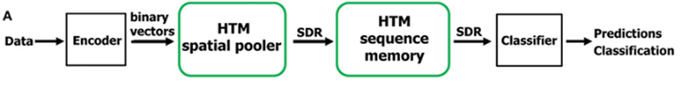

# ML22/23-2	Investigate and Implement KNN Classifier


## Feature overview

*   [x] **KNN Classifier implemented in C#** 
*   [x] **KNN Classifier integrated with HTM**
## Contents

*   [What is this?](#what-is-this)
*   [Getting started](#getting-started)
    *   [Install](#install)
*  [Integration of Classifiers with Neocortex API](#integration-of-classifiers-with-neocortex-api)
*  [Usage](#usage)
*  [Conclusion](#conclusion)
*  [Sources](#sources)
        
## What is this?

This code presents a KNN classifier implemented in C#, which is further enhanced by integrating it with the Neocortex API. The Neocortex API facilitates retrieving input datasets from a Hierarchical Temporal Memory (HTM). Essentially, this KNN model takes a continuous stream of sequences from HTM as input. It then processes these sequences to determine whether the predicted sequence aligns with or deviates from the input data sequence. In simpler terms, the KNN classifier analyzes incoming data sequences from HTM through the Neocortex API, discerning whether they match or diverge from the expected patterns.

## Getting Started

To set up the necessary components for this project, please follow the instructions provided below.

### Install

To get started, make sure you have the .NET framework installed on your system.
- **The latest version of .NET is 8.0**: Refer to the [Install .NET on Windows Guide](https://learn.microsoft.com/en-us/dotnet/core/install/windows?tabs=net80) for detailed instructions on setting up .NET.

Command to add NeoCortexApi NuGet package: 
 ```bash
dotnet add package NeoCortexApi --version 1.1.4
```

For managing NuGet packages. 
- **NuGet packages**: Refer to the [Install and manage NuGet packages](https://learn.microsoft.com/en-us/nuget/consume-packages/install-use-packages-dotnet-cli) to easily install, uninstall, and update NuGet packages in .NET projects and solutions.

## Integration of Classifiers with Neocortex API
The figure below shows the hierarchical structure of HTM-CLA. The basic unit of hierarchy is the cell in HTM-CLA. The cells are organized in columns. These columns combine to form a region and regions combine to form hierarchies. The cells can be connected with other cells in the same region or regions at upper or lower levels. The cells learn and store the temporal sequence of the data while columns denote the semantics of the data through SDR representations. Classifier tries to infer the output from active columns in the upper region in the hierarchy.  The old knnClassifier maps the nearest neighbors and infers the output class. However, it requires every data point to be stored in memory which results in very high complexity for huge datasets.   



To better understand HTM CLA refer to the [NeoCortext documentation](https://github.com/ddobric/neocortexapi/blob/master/source/Documentation/gettingStarted.md)

## Usage

**Program.cs** and **MultiSequenceLearning.cs** classes are already implemented in Neocortex API.
- **TemporalMemory**: Refer to the [How to use TemporalMemory algorithm](https://github.com/ddobric/neocortexapi/blob/master/source/Documentation/TemporalMemory.md) for detailed instructions on setting up HTM.

We have implemented [KnnClassifier.cs](https://github.com/UniversityOfAppliedSciencesFrankfurt/se-cloud-2022-2023/edit/Team_Mariglen_Kejdjon/MySEProject/README.md), which can be found ate the following location in this repository: 
 ```bash
MySEProject/MyProjectSample/KnnClassifier.cs
```
In order to integrate the **KnnClassifier.cs** with HTM, in **MultiSequenceLearning.cs** class you replace: 
```bash
HtmClassifier<string, ComputeCycle> cls = new HtmClassifier<string, ComputeCycle>();
```
with the following line:
```bash
 KnnClassifier<string, ComputeCycle> cls = new KnnClassifier<string, ComputeCycle>();
```
Next step is to modify the [Predictor.cs](https://github.com/ddobric/neocortexapi/blob/master/source/NeoCortexApi/Predictor.cs), you have to make two changes in this class. Replace this two lines: 
```bash
private HtmClassifier<string, ComputeCycle> classifier { get; set; };
public Predictor(CortexLayer<object, object> layer, Connections connections, HtmClassifier<string, ComputeCycle> classifier)
```
With the following lines: 
```bash
private KnnClassifier<string, ComputeCycle> classifier { get; set; }
public Predictor(CortexLayer<object, object> layer, Connections connections, KnnClassifier<string, ComputeCycle> classifier)
```
After following the instruction above, you have a integrated KnnClassifier with HTM in [NeocortexApi](https://github.com/ddobric/neocortexapi).

Here is a step-by-step video demonstration on how to execute the K-Nearest Neighbors (KNN) classifier and conduct unit testing:

[Watch the demonstration video](https://github.com/UniversityOfAppliedSciencesFrankfurt/se-cloud-2022-2023/blob/Team_Mariglen_Kejdjon/MySEProject/Documentation/Demonstration_Video.mp4)


## Conclusion:  

The K-Nearest Neighbors (KNN) model has been seamlessly integrated with the Neocortex API, allowing it to efficiently process data streams and make predictions. Through this integration, the model receives sequences of data and accurately classifies them as either matching or mismatching the input sequence. 

To ensure robustness, unit tests have been meticulously crafted to cover various special cases. These tests have been designed with the HTM Classifier as a reference, yielding highly satisfactory outcomes. Overall, the successful integration of the KNN model with the Neocortex API, coupled with rigorous testing procedures, underscores the reliability and effectiveness of the classification system.

## Sources
1. [NeoCortext API](https://github.com/ddobric/neocortexapi)
2. [University implementation](https://github.com/UniversityOfAppliedSciencesFrankfurt/LearningApi/blob/f713a28984e8f3115952c54cd9d60d53faa76ffe/LearningApi/src/MLAlgorithms/AnomDetect.KMeans/KMeansAlgorithm.cs)
3. [HTM School](https://www.youtube.com/playlist?list=PL3yXMgtrZmDqhsFQzwUC9V8MeeVOQ7eZ9&app=desktop)
4. [K-Nearest Neighbor](https://medium.com/swlh/k-nearest-neighbor-ca2593d7a3c4)


